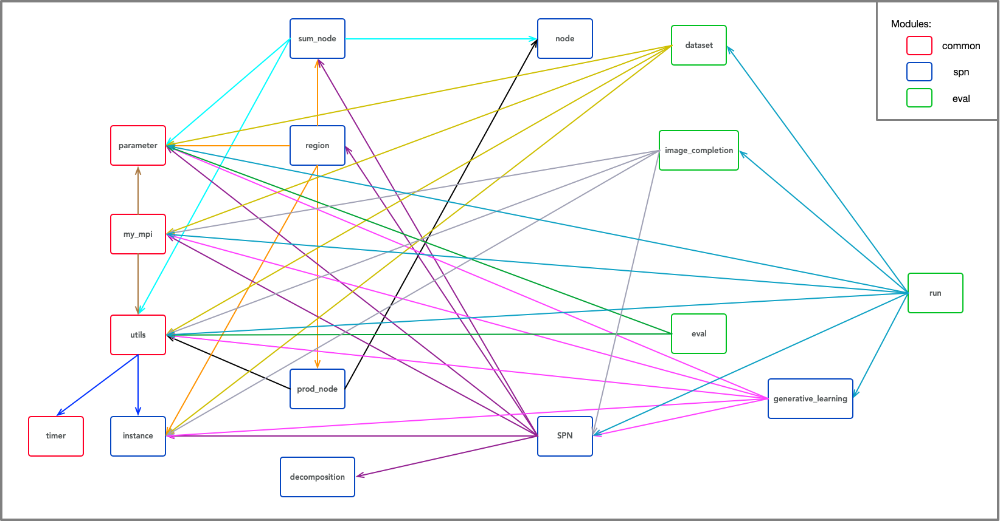

# Undergraduate-thesis

*Sum-product network* (**SPN**) implementation and its application on image completion and gene dataset.

## Content

[About this repo](#about-this-repo)

[Documents of Code](#documents-of-code)

[Callgraph of Program](#callgraph-of-program)

[How to Run](#how-to-run)

[Results](#results)

[Timeline](#timeline)

[Author](#author)

[Acknowledgement](#acknowledgement)

[License](#license)

---

### About this repo

TODO

### Documents of Code

1. **common**
   1. `my_mpi`: Use **OpenMPI** to support the messaging in a parallel program. It means that this program will use parallel architecture to accelerate computing.
   2. `parameter`: Control parameters for EM algorithm, SPN, and evaluation.
   3. `timer`: Manage the time to help calculate the time spent on computation.
   4. `utils`: Some helper functions to access time, print log, and do some numeric process.
2. **evaluation**
   1. `dataset`: Read and process data from the dataset.
   2. `eval`: Conduct evaluation over the dataset.
   3. `image_completion`: Conduct image completion, which is the application.
   4. `run`: Control the program, which is the main function.
3. **spn**
   1. `decomposition`: Decompose the regions.
   2. `generative_learning`: Conduct the learning process to generative the model.
   3. `instance`: Record the mean and variance of an instance, which is calculated from the dataset.
   4. `node`: Define the node, to provide the base class of the sum node and the product node.
   5. `prod_node`: Define the product node, derived from `node`.
   6. `sum_node`: Define the sum node, derived from `node`.
   7. `region`: Compute the mean and variance of regions in the picture(for this image completion application), as well as the MAP.
   8. `SPN`: Define the Sum-product network, including a root, functions of learning and applications. These functions are implemented via calling other modules.

### Callgraph of Program

This picture will show the call graph between modules of this program.



### How to Run

Under folder `Implementation`, run the following commands:

```sh
make run # to run the learning process
make eval # to do evaluation
```

TODO

### Results

TODO

### Timeline

- [x] Implementation of SPN (*Dec. 28, 2018*)

- [x] Documents of Code (*Jan. 31, 2019*)

- [x] Implementation of rest part(*Mar. 4, 2019*)

- [ ] Reproduce of the Original Application (*Mar. 15, 2019*)

- [ ] Further Exploration and Optimization (*Mar. 25, 2019*)

- [ ] Interim Report (*April 4, 2019*)

- [ ] Thesis (*April 15, 2019*)

- [ ] Presentation and Defence (*TBD*)

### Author

Yilin ZHENG  

E-mail: 11510506@mail.sustc.edu.cn

### Acknowledgement

Prof. He & Prof. Tang

Dr. Lee

### License

    **MIT**